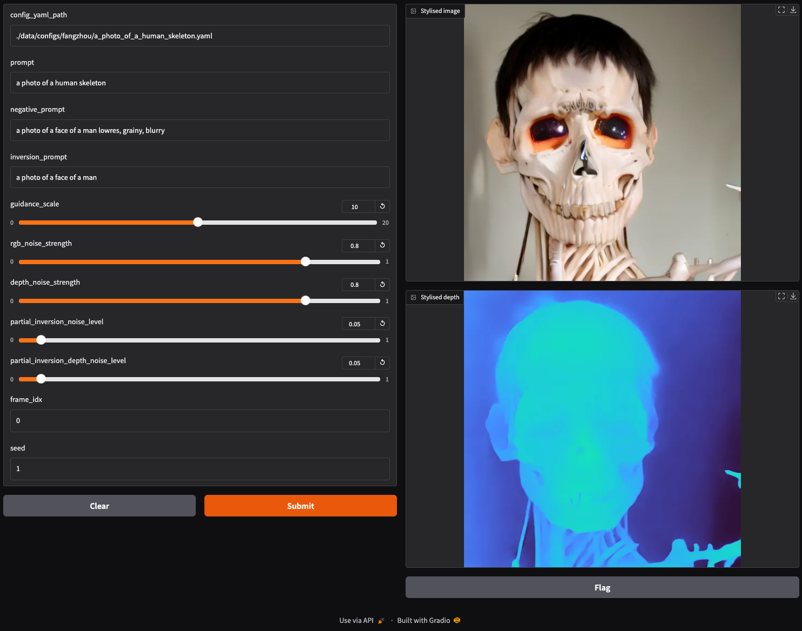

# Morpheus: Text-Driven 3D Gaussian Splat Shape and Color Stylization

An autoregressive 3D Gaussian Splatting stylization method, using a RGBD diffusion model that allows for independent control over appearance and shape. 

> **Morpheus: Text-Driven 3D Gaussian Splat Shape and Color Stylization**
>
> [Jamie Wynn<sup>*1</sup>](https://www.linkedin.com/in/jamie-wynn-69a392139), [Zawar Qureshi<sup>*1</sup>](https://www.linkedin.com/in/zawarqureshi), [Jakub Powierza<sup>1</sup>](https://www.linkedin.com/in/jakub-powierza/), [Jamie Watson<sup>1,2</sup>](https://www.linkedin.com/in/jamie-watson-544825127/), and [Mohamed Sayed<sup>1</sup>](https://masayed.com).
> 
> 
> <sup>*</sup> denotes equal contribution, <sup>1</sup>Niantic, <sup>2</sup>UCL
> 
> [Paper, CVPR 2025 (arXiv pdf)](https://arxiv.org/abs/2503.02009), [Project Page](https://nianticlabs.github.io/morpheus/)

https://github.com/user-attachments/assets/28c47146-1486-41fe-b02a-8fee278779f9

## Table of Contents

- [Morpheus: Text-Driven 3D Gaussian Splat Shape and Color Stylization](#morpheus-text-driven-3d-gaussian-splat-shape-and-color-stylization)
  - [Table of Contents](#table-of-contents)
  - [🏃 Quickstart](#-quickstart)
  - [📖 Pipeline CLI reference](#-pipeline-cli-reference)
  - [📦 Interactive Gradio demo app for RGBD Model inference](#-interactive-gradio-demo-app-for-rgbd-model-inference)
  - [🔨 Training](#-training)
  - [🙏 Acknowledgements](#-acknowledgements)
  - [📜 BibTeX](#-bibtex)
  - [👩‍⚖️ License](#-license)

## Quickstart

1. Download our diffusion models:

```bash
make download-models
```

This will download and extract our RGBD diffusion model and our Warp ControlNet into `data/models/`. 

2. Download our input data:

```bash
make download-input-data
```

For each scene, this will download a 3D Gaussian Splatting model, the renders from that model that we use as input to our pipeline, and the configs for each prompt we use for evaluation and the user study.

The structure for the data looks like this:

```
data
    configs
        a_-_microscopes
            Ancient_alchemist_s_lab_with_potion_bottles__parch.yaml
            Medieval_herbalist_lab_with_dried_plants__wooden_t.yaml
            ...
        b_-_robot_arm
            1950s_diner-style_lounge_with_checkered_floors__re.yaml
            ...
    scenes
        a_-_microscopes
            3dgs (nerfstudio format 3DGS checkpoint and config)
            dataparser_transforms.json
            final-path-square.json (nerfstudio render json path)
            render_regsplatfacto
                00000_depth.npy (rendered depth map)
                00000_rgb.png (rendered RGB frame)
                00000.jpg (concat of RGB and colormapped depth for visualization)
        b_-_robot_arm
            ...
```

3. Set up and activate the conda environment:

```bash
make install-mamba
make create-mamba-env
conda activate morpheus
```

4. Run the pipeline on a scene. The pipeline is controlled by config files that specify paths to
input data, prompts, and hyperparameters. Example:

```bash
python -m morpheus.pipeline --config-path ./data/configs/fangzhou/a_photo_of_a_human_skeleton.yaml
```

## 📖 Pipeline CLI reference

The Morpheus pipeline can be configured using command-line arguments or YAML configuration files. Here's a comprehensive list of all available options:

### Configuration Options

| Argument | Type | Default | Description |
|----------|------|---------|-------------|
| `--config-path` | Path | None | Path to a YAML configuration file containing pipeline parameters |

### Required Arguments

| Argument | Type | Description |
|----------|------|-------------|
| `--prompt` | str | Text prompt that controls the stylization direction |
| `--input-renders-path` | Path | Path to the Nerfstudio render RGB & depth images |
| `--input-transform-json-path` | Path | Path to the Nerfstudio transform JSON file of the trained splat |
| `--input-camera-paths-path` | Path | Path to the Nerfstudio camera paths JSON file with the trajectory |
| `--output-data-path` | Path | Output directory for pipeline results |

### Text Prompts

| Argument | Type | Default | Description |
|----------|------|---------|-------------|
| `--negative-prompt` | str | "" | Negative text prompt to avoid certain elements in stylization |

### Frame Processing Control

| Argument | Type | Default | Description |
|----------|------|---------|-------------|
| `--group-of-pictures-size` | int | 20 | Number of frames in each group of pictures (GoP) |
| `--start-index` | int | 0 | First frame index to process |
| `--end-index` | int | None | Last frame index to process (processes all frames if not specified) |
| `--permute-frames-by` | int | 0 | Shift frame selection by this offset |
| `--i-frame-only` | bool | False | Process only the first I-frame (useful for debugging) |

### Image Resolution Control

| Argument | Type | Default | Description |
|----------|------|---------|-------------|
| `--resolution` | int | None | Target height resolution (width will be matched if `--square-image` is set) |
| `--square-image/--full-res` | bool | True | Whether to crop images to squares |

### Diffusion Model Control

| Argument | Type | Default | Description |
|----------|------|---------|-------------|
| `--controlnet-strength` | float | 0.5 | Strength of ControlNet guidance for all frames |
| `--guidance-scale` | float | 12.5 | Diffusion model's classifier-free guidance scale for all frames |
| `--noise-strength` | float | 0.95 | Strength of noise added during diffusion for all frames |
| `--depth-noise-strength` | float | None | Strength of noise added to depth for all frames |
| `--initial-seed` | int | 1 | Random seed for reproducibility |

### I-Frame Specific Controls

These parameters allow fine-tuning of the initial frame generation. An I-frame is a fully stylized reference frame that serves as the foundation for generating subsequent frames:

| Argument | Type | Default | Description |
|----------|------|---------|-------------|
| `--i-frame-controlnet-strength` | float | None | ControlNet strength for initial I-frame only |
| `--i-frame-noise-strength` | float | None | Noise strength for initial I-frame only |
| `--i-frame-depth-noise-strength` | float | None | Depth noise strength for initial I-frame only |
| `--i-frame-guidance-scale` | float | None | Guidance scale for initial I-frame only |

### Model Paths

| Argument | Type | Default | Description |
|----------|------|---------|-------------|
| `--stable-diffusion-model-path` | Path | None | Path to custom Stable Diffusion model |
| `--controlnet-model-path` | Path | None | Path to custom ControlNet model |
| `--huggingface-cache-dir` | Path | None | Custom HuggingFace cache directory |

### Pipeline Components

| Argument | Type | Default | Description |
|----------|------|---------|-------------|
| `--run-resplatting/--no-run-resplatting` | bool | False | Whether to run resplatting after pipeline completion |

### Advanced Options

| Argument | Type | Default | Description |
|----------|------|---------|-------------|
| `--debug` | bool | False | Enable debug mode with additional visualizations |
| `--extra-inpainter-args` | dict | None | Additional parameters for the inpainter component |
| `--extra-p-frame-generator-args` | dict | None | Additional parameters for P-frame generation |
| `--extra-compositor-args` | dict | None | Additional parameters for frame composition |
| `--extra-nerfstudio-args` | dict | None | Additional parameters for NerfStudio integration |

### Usage Notes

- We refer to 2 kinds of frames in our pipeline:
    - I-frames: Fully generated from scratch using the RGBD diffusion model
    - P-frames: Generated by warping and compositing from previous frames (including the I-frame), then generating only the missing/occluded regions with the help if the warp controlnet
- If both command-line arguments and config file values are provided, command-line arguments take precedence over defaults, but config file values override defaults when CLI arguments aren't explicitly set
- The pipeline saves all used parameters to `pipeline_params.yaml` in the output directory for reproducibility
- Debug mode creates additional visualization outputs in subdirectories of the output path
- When `--square-image` is False, the `--resolution` parameter is ignored


## 📦 Interactive Gradio demo app for RGBD Model inference



You can start an interactive demo app for running inference on the RGBD Model with:

```bash
python -m morpheus.interactive.rgbd_model
```

The interactive RGBD model demo accepts the following parameters through the Gradio interface:

### Demo Configuration

| Parameter | Type | Description |
|-----------|------|-------------|
| `config_yaml_path` | str | Path to YAML configuration file containing dataset and model paths |
| `prompt` | str | Text prompt for stylization |
| `negative_prompt` | str | Negative text prompt to avoid certain elements |
| `inversion_prompt` | str | Prompt used for DDIM inversion process |

### Diffusion Control

| Parameter | Type | Description |
|-----------|------|-------------|
| `guidance_scale` | float | Classifier-free guidance scale for diffusion model |
| `rgb_noise_strength` | float | Strength of noise added to RGB image during diffusion |
| `depth_noise_strength` | float | Strength of noise added to depth map during diffusion |

### Partial Inversion Control

| Parameter | Type | Description |
|-----------|------|-------------|
| `partial_inversion_noise_level` | float | Noise level for partial DDIM inversion on RGB |
| `partial_inversion_depth_noise_level` | float | Noise level for partial DDIM inversion on depth |

### Frame Selection

| Parameter | Type | Description |
|-----------|------|-------------|
| `frame_idx` | int | Index of the frame to process from the dataset |
| `seed` | int | Random seed for reproducible generation |

### Usage Notes

- The config file should contain paths to `input_renders_path`, `input_transform_json_path`, and `input_camera_paths_path`
- Model paths (`stable_diffusion_model_path`, `controlnet_model_path`) are loaded from the config or use defaults

## 🔨 Training

Coming soon!

## 🔨 Evaluation

Coming soon!

## 🙏 Acknowledgements

Our depth-guided feature sharing makes use of code from [GaussCtrl](https://github.com/ActiveVisionLab/gaussctrl). Some utility code for handling depths comes from [MiDaS](https://github.com/isl-org/MiDaS).

We would like to also acknowledge the work done by authors of [StableDiffusion](https://github.com/Stability-AI/stablediffusion), [DepthAnythingV2](https://github.com/DepthAnything/Depth-Anything-V2), [Marigold](https://github.com/prs-eth/Marigold), and [GeoWizard](https://github.com/fuxiao0719/GeoWizard) whose models we use to generate our training data.

We are grateful to the following colleagues for their support and helpful discussions: Sara Vicente, Saki Shinoda,
Stanimir Vichev, Michael Firman, and Gabriel Brostow.

## 📜 BibTeX

If you find our work useful in your research please consider citing our paper:

```
@inproceedings{wynn2025morpheus,
  title={Morpheus: Text-Driven 3D Gaussian Splat Shape and Color Stylization},
  author={Wynn, Jamie and Qureshi, Zawar and Powierza, Jakub and Watson, Jamie and Sayed, Mohamed},
  booktitle={Proceedings of the Computer Vision and Pattern Recognition Conference},
  pages={7825--7836},
  year={2025}
}
```

## 👩‍⚖️ License

Copyright © Niantic Spatial, Inc. 2025. Patent Pending.
All rights reserved.
Please see the [license file](LICENSE) for terms.
